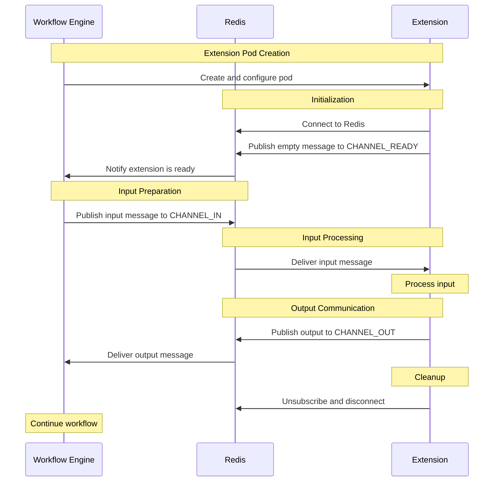

# How an extension communicates with Redis and performs its work within the workflow system.

1. **Extension Pod Creation**: The Workflow Engine creates and configures the extension pod.

2. **Initialization**:
   - The Extension connects to Redis.
   - It publishes an empty message to CHANNEL_READY to signal it's ready to receive input.
   - Redis notifies the Workflow Engine that the extension is ready.

3. **Input Preparation**: The Workflow Engine publishes an input message to CHANNEL_IN.

4. **Input Processing**:
   - Redis delivers the input message to the Extension.
   - The Extension processes the input.

5. **Output Communication**:
   - The Extension publishes the output to CHANNEL_OUT.
   - Redis delivers the output message to the Workflow Engine.

6. **Cleanup**: The Extension unsubscribes from Redis channels and disconnects.

7. **Workflow Continuation**: The Workflow Engine continues with the next steps in the workflow.

This diagram provides a clear visual representation of how an extension communicates with Redis and fits into the overall workflow process.